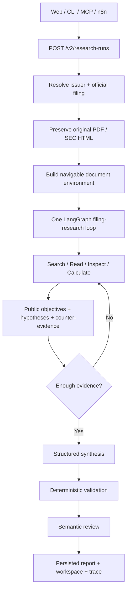

<div align="center">

# ResearchForge

**Evidence-first AI research for public-company financial filings.**

> **Auditable filing research over one canonical V2 runtime.**

[简体中文](README.zh-CN.md) · [Architecture](docs/architecture/v2-filing-research.md) · [Project Status](PROJECT_STATUS.md) · [Decisions](DECISIONS.md)


</div>

ResearchForge is a filing-only AI research agent for listed companies. Give it a company or ticker, a reporting period, and a research question. It resolves the issuer, acquires the official filing, keeps the original source, searches and reads evidence, performs deterministic financial calculations where possible, checks counter-evidence, and returns a source-linked report with a durable public trace.

> [!IMPORTANT]
> V2 is the **only live research runtime**. Web, API, CLI, MCP, and n8n all create or read the same persisted V2 Research Run. Historical V1 assets remain audit history only.

> [!NOTE]
> Independent multi-issuer held-out Owner Acceptance is **not yet established**. Passing engineering gates and development canaries is not presented as proof of universal research quality.

---

## What makes it different

| Capability | What ResearchForge does |
| --- | --- |
| **Official-source first** | Resolves CN / US / HK issuers and acquires official financial filings instead of treating open-web snippets as source truth. |
| **Full filing stays available** | The initial retrieval is only a seed. Pages, sections, native tables, figures, and footnote candidates remain addressable throughout the run. |
| **Agentic but bounded** | One LangGraph loop chooses search / read / inspect / calculate / submit actions while deterministic limits own time, budget, source scope, and cancellation. |
| **Deterministic finance** | Financial arithmetic uses verified inputs and Python `Decimal`; the model does not become the authority for formulas or units. |
| **Counter-evidence before stopping** | Material analytical conclusions require targeted counter-evidence search before the agent can converge. |
| **Inspectable output** | Every important conclusion can link back to evidence, facts, calculations, and a persisted public research journal. |
| **One runtime everywhere** | Browser, CLI, MCP, and n8n are thin clients over the same `/v2` API and artifact store. |

The Web workspace also includes clickable research-question presets for common tasks such as profitability quality, growth drivers, cash-flow health, receivables/inventory, capital intensity, major risks, and governance anomalies.

---

## Product flow



The browser, MCP, and n8n do **not** own separate prompts, retrieval engines, financial formulas, or research state.

---

## Current model routing

The recommended local route is `hybrid`:

| Role | Model / provider |
| --- | --- |
| Research tool loop | DeepSeek V4 Flash |
| Public-state reflection | DeepSeek V4 Flash |
| Structured synthesis | DeepSeek V4 Flash |
| Claim-wise semantic review | Qwen Plus |
| Research fallback | Qwen Plus |
| Fallback reflection / synthesis | Qwen3-Max |
| Semantic-review fallback | DeepSeek V4 Flash |
| Page-image inspection | Qwen3-VL Plus |
| Kimi | Optional standby metadata; not required by the active route |

DeepSeek timeout / connection errors and HTTP `402 / 408 / 429 / 5xx` can visibly switch the rest of a run to the Qwen fallback chain. HTTP `400` remains fail-closed.

Provider-private histories never cross provider boundaries. Handoffs use typed public Research State, evidence IDs, and run-owned artifacts.

---

## Supported source boundary

| Market | Resolution | Official source | Filing shape |
| --- | --- | --- | --- |
| China A-shares | ticker / Chinese company name | CNINFO / official exchange disclosure | PDF |
| United States | ticker / issuer name | SEC EDGAR | HTML / XBRL-linked filing |
| Hong Kong | ticker / English / Chinese company name | HKEXnews | PDF |

ResearchForge V2 is intentionally **filing-only**. It does not claim unrestricted web/news research, broker research, target prices, trading, portfolio management, multi-agent debate, or arbitrary shell/Python execution.

---

## Quick start

### 1. Requirements

- Python `3.12`
- Node.js `24`
- Docker Desktop for the packaged stack
- `uv`

### 2. Install dependencies

```bash
uv sync --frozen --all-groups
npm ci --prefix frontend
```

### 3. Configure a provider

```bash
cp .env.example .env
```

Recommended hybrid configuration:

```dotenv
RESEARCHFORGE_PROVIDER=hybrid

RESEARCHFORGE_DEEPSEEK_API_KEY=...
RESEARCHFORGE_DEEPSEEK_BASE_URL=https://api.deepseek.com

RESEARCHFORGE_QWEN_API_KEY=...
RESEARCHFORGE_QWEN_BASE_URL=https://YOUR_WORKSPACE_ID.cn-beijing.maas.aliyuncs.com/compatible-mode/v1

# Optional today; the active hybrid route does not require Kimi.
RESEARCHFORGE_KIMI_API_KEY=
RESEARCHFORGE_KIMI_BASE_URL=
```

A Qwen-only path is also supported by setting `RESEARCHFORGE_PROVIDER=qwen` and configuring the Qwen key/base URL. The OpenAI path remains available in code and requires its local key plus the project key-rotation confirmation guard.

### 4. Start the canonical product stack

```bash
uv run python scripts/start_demo.py
```

Then open:

- Web: `http://127.0.0.1:4173/`
- API: `http://127.0.0.1:8000/`
- n8n form: `http://127.0.0.1:5678/form/researchforge-v2-form`

`/research/v2` is only a compatibility alias for the same V2 Web workspace.

### 5. Run API and Web separately (optional)

```bash
RESEARCHFORGE_REASONING_MODE=auto \
uv run uvicorn researchforge.api.app:create_app --factory --reload

npm run dev --prefix frontend
```

---

## Web workspace

The intake separates:

```text
Company / Ticker
Market
Year
Report type
Research question
```

Year and report type are selected independently; the frontend composes them into backend labels such as `2024H1` or `2025FY`.

During and after a run, the browser exposes:

- research objectives and evidence boundaries;
- answer-first report and key findings;
- verified financial facts and deterministic calculations;
- full filing navigation, native tables, original document access, and page images where available;
- public hypotheses and counter-evidence;
- a human-readable research journal;
- a separate engineering-audit view with raw event details.

Internal run/source IDs and internal state enums are sanitized from normal user-facing prose while remaining available in structured audit fields.

---

## API

Create a run:

```http
POST /v2/research-runs
```

Core input fields:

```text
company_query
market_hint: CN | US | HK | null
requested_period_label: 2025FY / 2025H1 / 2025Q1 ... | null
research_question
research_time
idempotency_key
```

Read the same persisted run through:

```text
GET  /v2/research-runs
GET  /v2/research-runs/{run_id}
GET  /v2/research-runs/{run_id}/result
GET  /v2/research-runs/{run_id}/workspace
GET  /v2/research-runs/{run_id}/trace
GET  /v2/research-runs/{run_id}/events
GET  /v2/research-runs/{run_id}/facts
GET  /v2/research-runs/{run_id}/calculations
GET  /v2/research-runs/{run_id}/search?query=...
GET  /v2/research-runs/{run_id}/sources/{source_id}
GET  /v2/research-runs/{run_id}/documents/{document_id}/original
GET  /v2/research-runs/{run_id}/page-images/{page_id}
POST /v2/research-runs/{run_id}/cancel
```

Safe, non-secret runtime routing metadata is available at:

```http
GET /v2/capabilities
```

There is no live V1 research execution API.

---

## CLI

The CLI is a thin client over the running V2 API:

```bash
uv run researchforge capabilities
uv run researchforge run "宁德时代" "分析现金流是否健康" --market CN --period 2024H1
uv run researchforge show <RUN_ID> --resource result
uv run researchforge show <RUN_ID> --resource workspace
uv run researchforge show <RUN_ID> --resource trace
```

---

## MCP

Start the MCP server:

```bash
uv run researchforge-mcp

# Optional localhost Streamable HTTP
uv run researchforge-mcp \
  --transport streamable-http \
  --host 127.0.0.1 \
  --port 8001
```

Seven bounded tools use the same V2 backend:

```text
resolve_company
discover_filing
run_company_research
get_research_result
get_research_trace
get_financial_facts
search_filing_evidence
```

---

## n8n

The active workflow is:

```text
integrations/n8n/researchforge-v2.workflow.json
```

n8n only handles transport, polling, and presentation. It submits `/v2/research-runs` and reads the same `/result`, `/workspace`, and `/trace` resources; it does not generate a second research answer.

See [integrations/n8n/README.md](integrations/n8n/README.md) for the integration contract.

---

## Data and persistence

The active runtime has one canonical data path:

```text
artifacts/v2/
├── blobs/           # original filing bytes
├── document-cache/  # reusable official-filing parse cache
├── runs/            # run manifests + artifact pointers
├── events/          # durable public trace
├── checkpoints/     # resumable LangGraph public state
└── budget/          # provider budget ledgers
```

The packaged V2 runtime does not depend on PostgreSQL, Alembic, the historical reviewed-package registry, fixture namespaces, or benchmark data.

Historical V1 schemas, benchmark/evolution evidence, screenshots, reviewed filing packages, and old persisted Runs remain in the repository only for auditability and reproducibility. They cannot satisfy a new V2 product Run.

---

## Repository map

```text
src/researchforge/v2/        V2 agent runtime, tools, reports, validation
src/researchforge/           shared deterministic primitives + API/CLI/MCP
frontend/src/v2/             browser research workspace
integrations/n8n/            V2 workflow + transport tests
schemas/v2/                  generated V2 JSON schemas
docs/architecture/           architecture contracts
docs/product/                implementation / acceptance notes
docs/contracts/v2/           V2 quality and benchmark contracts
tests/v2/                    V2 regression and evaluation tests
```

---

## Engineering verification

Core local gates:

```bash
uv lock --check
uv run ruff format --check src/researchforge scripts tests
uv run ruff check .
uv run mypy --strict src/researchforge
uv run pytest -q
uv run python scripts/validate_contracts.py

npm run typecheck --prefix frontend
npm run lint --prefix frontend
npm test --prefix frontend -- --run
npm run build --prefix frontend

node integrations/n8n/build-workflow.mjs --check
node --test integrations/n8n/workflow.test.mjs
```

Zero-provider-call packaging checks:

```bash
uv run python scripts/container_gate.py
python scripts/docker_smoke.py
python -m scripts.n8n_smoke
```

Dependency audits:

```bash
uv run pip-audit --local --skip-editable
npm audit --audit-level=high --prefix frontend
```

GitHub Actions runs backend, contract/schema, security, frontend/E2E, and packaged-container jobs in [`.github/workflows/ci.yml`](.github/workflows/ci.yml).

---

## Quality boundary

ResearchForge separates **engineering correctness** from **research-quality acceptance**.

- Public FinanceBench cases are development/canary material, not held-out evidence.
- Model semantic review is explicitly not ground truth.
- Previously exposed held-out suites A–I are retired after inspection/tuning.
- No automatic J/K/L suite is created merely to chase a passing score.
- A fresh quality claim requires a separately frozen unseen suite plus blind Owner judgment.

See [PROJECT_STATUS.md](PROJECT_STATUS.md) and [docs/product/v2-filing-research-implementation.md](docs/product/v2-filing-research-implementation.md) for the current evidence boundary.

---

## Historical V1 evidence

V1 is preserved as history, not as an executable alternative:

- `schemas/v1.2` through `schemas/v1.8` remain historical contracts/evidence;
- old n8n workflow JSONs remain frozen audit artifacts and are not imported by V2 startup;
- `project-status.json` remains the frozen V1 release checkpoint;
- the historical V1.4 evolution result remains recorded rather than rewritten.

---

## Non-goals

ResearchForge does not claim to be a trading system, recommendation engine, real-time market-data platform, unrestricted web researcher, multi-agent debate framework, or universal valuation engine.

---

## More documentation

- [中文 README](README.zh-CN.md)
- [V2 architecture](docs/architecture/v2-filing-research.md)
- [V2 implementation & acceptance boundary](docs/product/v2-filing-research-implementation.md)
- [Financial methodology](docs/contracts/financial-methodology.md)
- [Current project status](PROJECT_STATUS.md)
- [Architecture/product decisions](DECISIONS.md)
- [Changelog](CHANGELOG.md)
- [Data notice](DATA_NOTICE.md)

## License

MIT — see [LICENSE](LICENSE).
