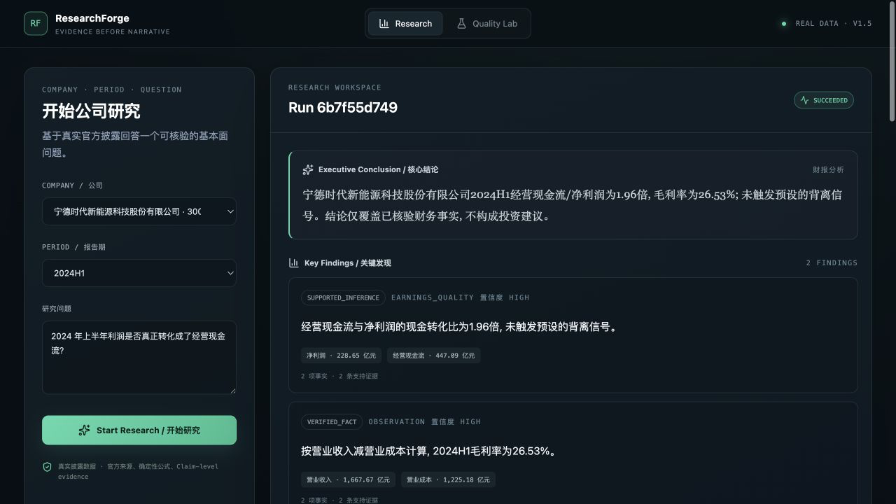

# ResearchForge

[](https://github.com/pocketvin/researchforge/actions/workflows/ci.yml)

> **An evidence-grounded AI fundamental research workspace for A-share company research.**

ResearchForge is for individual researchers, finance learners and junior analysts who want a
fast first-pass company study but do not want to trust a financial chatbot's black box.

Give it:

```text
Company + Period + Research Question
```

For example:

```text
宁德时代 + 2024H1 + “2024 年上半年利润是否真正转化成了经营现金流？”
```

ResearchForge turns official public disclosures into a result you can audit:

```text
Official Disclosure → Evidence → Financial Facts → Deterministic Calculations
→ Research Reasoning → Counter Evidence → Verification → Monitoring Plan
```

Unlike a general financial chatbot, ResearchForge does not ask the model to remember filings or
perform important arithmetic. Every material conclusion links back to facts and source locators;
every important number has a deterministic formula record; missing or incompatible evidence
causes an explicit limitation or abstention.

## What the user gets

A completed research report answers:

1. What is the conclusion?
2. Which financial facts matter?
3. How were the numbers calculated?
4. Where does each important fact come from?
5. Was conflicting evidence found?
6. What are the current limitations?
7. What should be monitored in the next filing?

The primary product is the **Research** workspace. The historical Skill Evolution system is
preserved as an experimental, read-only **Quality Lab** and is not required for normal research.

## Current status

- Active direction: **V1.5 Productization**
- V1.5 productization: **independently accepted — VERDICT: PASS**
- Current milestone: Phase 5 Web/n8n UX and demo hardening over the same verified backend
- Preserved baseline: V1.4 contracts, fixtures, experiments, hashes and negative result
- Default runtime: strict `product` namespace with CATL 2024H1, CATL 2024FY and BYD 2024H1
- Human usefulness: **not yet validated; formal Web+n8n evaluation is deferred to final Phase 6**
- Investment advice, trading and price prediction: **not provided**

The authoritative V1.5 direction is
[`docs/product/researchforge-v1.5-product-thesis.md`](docs/product/researchforge-v1.5-product-thesis.md).
It defines the target user, product promise, real-data boundary, acceptance criteria and migration
from V1.4.
The remaining delivery sequence is frozen in
[`docs/product/researchforge-final-delivery-roadmap.md`](docs/product/researchforge-final-delivery-roadmap.md).

## Product architecture

| Layer | Owns |
|---|---|
| LLM | question understanding and bounded research reasoning over supplied evidence |
| Deterministic Python | `Decimal` formulas, period semantics, calculations and policy decisions |
| Evidence System | document identity, provenance, page/section locators and claim traceability |
| Verifier | consistency, citation resolution, required coverage and counter-evidence checks |
| LangGraph | one bounded ten-stage workflow, routing, checkpoint/recovery, cancellation and trace |
| n8n (optional) | external input, bounded wait/poll, explicit failures and unchanged backend output |
| Quality Lab | frozen experimental quality evidence, separate from the user journey |

ResearchForge uses Python 3.12, FastAPI, Pydantic 2, LangGraph, SQLAlchemy/Alembic,
PostgreSQL, React, TypeScript and Vite. Immutable JSON artifacts use content-addressed storage.

## Product preview



Facts, formulas, evidence and trace stay collapsed until the user chooses to inspect them.
Quality Lab has a separate secondary surface and is not part of the normal research journey.

## Run the real-data demo

The same extractor and backend serve CATL 2024H1, CATL 2024FY and BYD 2024H1. See the
[three-filing recovery and Research Result evidence](docs/evidence/v1.5-generalization/README.md)
for every metric, source locator, calculation, counter-evidence boundary and monitoring item.

The repository includes a reviewed, public-safe derived package for the official CATL 2024H1
filing. Its six facts are deterministically recovered from the verified PDF rather than copied
from registry-provided values. This zero-cost command forces deterministic wording, makes no
provider call and never falls back to fixtures:

```bash
RESEARCHFORGE_REASONING_MODE=deterministic \
uv run researchforge catalog

RESEARCHFORGE_REASONING_MODE=deterministic \
uv run researchforge run \
  --task-type filing_analysis \
  --company cn_300750 \
  --period 2024H1 \
  --question '2024年上半年利润是否转化为经营现金流?' \
  --research-time '2026-09-03T00:00:00+08:00' \
  --idempotency-key 'v1.5-catl-2024h1-demo'
```

To rebuild the derived package, acquire the same allowlisted official PDF and verify its expected
hash before parsing:

```bash
uv run researchforge ingest-disclosure --company cn_300750 --period 2024H1
```

If a confirmed rotated `OPENAI_API_KEY` is present in ignored `.env`, `auto` mode uses the
Responses API for bounded wording over supplied facts and calculations. It does not enable web
search or model-side arithmetic, and `store` remains false.

Start the API:

```bash
uv run uvicorn researchforge.api.app:create_app --factory --reload
```

Start the frontend:

```bash
npm ci --prefix frontend
npm run dev --prefix frontend
```

Or run the packaged stack:

```bash
docker compose up -d --build --wait
uv run python scripts/docker_smoke.py
```

Docker Compose starts PostgreSQL, FastAPI and Nginx/React with persistent volumes and health
checks. See [`docs/demo/walkthrough.md`](docs/demo/walkthrough.md) for the reproducible V1.5
walkthrough and [`docs/demo/v1.5-demo-evidence.md`](docs/demo/v1.5-demo-evidence.md) for exact
source, run and verification evidence.

### Optional n8n entry

Use the [importable ResearchForge n8n workflow](integrations/n8n/README.md) to submit the same
Company + Period + Question through a local webhook. It returns the same backend facts,
calculations, evidence, report and Trace; n8n does not calculate finance or generate conclusions.
See [three real webhook runs and failure-path evidence](docs/evidence/v1.5-n8n/README.md).
This is an engineering integration, not a Human Validated label; final UX and Web+n8n evaluation
are subsequent frozen delivery phases.

## Research workflow

All supported research tasks reuse one LangGraph:

```text
understanding_question
→ planning
→ loading_financial_data
→ retrieving_evidence
→ calculating
→ cross_checking
→ searching_counter_evidence
→ forming_conclusion
→ validating_output
→ completed
```

LangGraph orchestrates. Plain Python owns finance, retrieval, verification and persistence.
The graph stores sanitized trace events and artifact IDs, not hidden chain-of-thought.

## API surface

Research resources:

- `POST /v1/research-runs`
- `GET /v1/research-runs/{run_id}`
- `GET /v1/research-runs/{run_id}/result`
- `GET /v1/research-runs/{run_id}/facts`
- `GET /v1/research-runs/{run_id}/evidence`
- `GET /v1/research-runs/{run_id}/calculations`
- `GET /v1/research-runs/{run_id}/trace`
- `POST /v1/research-runs/{run_id}/cancel`
- `GET /v1/catalog`

Quality Lab resources remain read-only. They are documented in the preserved V1.4 scope and are
not part of the normal research flow.

## Data safety and provenance

V1.5 separates three namespaces:

| Namespace | Purpose | Product fallback? |
|---|---|---:|
| `product` | acquired real public disclosures and derived research artifacts | primary |
| `fixture` | deterministic tests and reproducible local examples | explicit fixture mode only |
| `benchmark` | frozen evaluation and Quality Lab evidence | never |

Real acquisitions must retain official URL, document identity, publication and retrieval times,
content hash, page/section locator, parser/mapping version and provenance. Raw filing PDFs remain
ignored and are not committed. Unverified values are never filled from model memory.

## Quality Lab: preserved, not the product thesis

V1.4 executed two controlled formal experiments. Both ended at `NO_ELIGIBLE_CLUSTER`; no
Candidate was created, Validation was not opened and Final Test was not consumed. The immutable
terminal result is:

```text
RESEARCH_HYPOTHESIS_UNSUPPORTED_AFTER_TWO_EXPERIMENTS
```

That negative result, its thresholds, benchmark packages, hashes and audit evidence are frozen.
No third experiment is authorized. The result demonstrates honest experimentation but does not
define V1.5 product success.

Historical simulated usability records are also preserved and always labeled `SIMULATED` with
`human_user_value_validated: false`.

## Start here

1. [`docs/product/researchforge-v1.5-product-thesis.md`](docs/product/researchforge-v1.5-product-thesis.md) — active product authority.
2. [`docs/product/researchforge-final-delivery-roadmap.md`](docs/product/researchforge-final-delivery-roadmap.md) — frozen phase order and final release gate.
3. [`PROJECT_STATUS.md`](PROJECT_STATUS.md) — current milestone, completed evidence and next action.
4. [`docs/demo/walkthrough.md`](docs/demo/walkthrough.md) — reproducible demo and V1.5 target.
5. [`PORTFOLIO.md`](PORTFOLIO.md) — evidence-backed interview positioning.
6. [`DECISIONS.md`](DECISIONS.md) — architecture and scope decisions.

## Authority order

For V1.5 Productization:

1. `docs/product/researchforge-v1.5-product-thesis.md`;
2. `docs/product/researchforge-final-delivery-roadmap.md` for delivery order;
3. V1.5 contracts and schemas added through its migration plan;
4. unchanged V1.4 finance, evidence, workflow and safety contracts;
5. code and UI.

V1.2, V1.3 and V1.4 historical schemas, scope documents and frozen research evidence are not
silently reinterpreted or rewritten.

## Non-goals

ResearchForge does not add multi-agent debate, full-market ingestion, complex vector
infrastructure, real-time行情, news trading, price prediction, portfolio optimization, order
execution, investment recommendations, open-ended self-modification, mobile apps, Kubernetes or
enterprise multi-tenancy.

## Verification

V1.5 Phase 1 passed local gates, GitHub Actions
[run 33727245101](https://github.com/pocketvin/researchforge/actions/runs/33727245101) and final
independent read-only acceptance.

```bash
uv lock --check
uv run ruff format --check .
uv run ruff check .
uv run mypy --strict src scripts tests migrations
uv run pytest -q
uv run python scripts/validate_contracts.py
npm run typecheck --prefix frontend
npm run lint --prefix frontend
npm test --prefix frontend -- --run
npm run build --prefix frontend
```

The public repository is [pocketvin/researchforge](https://github.com/pocketvin/researchforge).

Phases 2–6 use these engineering gates without intermediate independent acceptance. One
project-wide independent read-only review runs only at the Phase 7 release freeze, after n8n,
both final UX surfaces, real-human evaluation and release evidence are complete.

## Disclaimer

ResearchForge is research-assistance software, not investment advice. Source availability,
parsing and normalized values must still be verified by the user before any financial decision.
