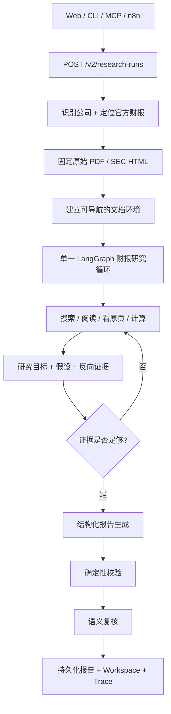

<div align="center">

# ResearchForge

**面向上市公司财务披露的、证据优先的 AI Research Agent。**

[English](README.md) · [架构说明](docs/architecture/v2-filing-research.md) · [项目状态](PROJECT_STATUS.md) · [决策记录](DECISIONS.md)


</div>

ResearchForge 是一个只研究**上市公司官方财务披露**的 AI Research Agent。你提供公司或股票代码、报告期和研究问题后，它会识别公司、定位官方财报、保存原始文件、搜索与阅读证据、在可以确定性计算时完成财务计算、主动寻找反向证据，并输出可以逐条回到原文的研究报告和持久化研究轨迹。

> [!IMPORTANT]
> **V2 是当前唯一的在线研究运行时。** Web、API、CLI、MCP 和 n8n 都创建或读取同一套 V2 Research Run，不再存在另一套隐藏的 V1 研究引擎。

> [!NOTE]
> 当前尚未建立独立、多公司的 held-out Owner Acceptance。工程测试通过、开发集 canary 表现良好，都**不能**被包装成“研究质量已经普遍验收”。

---

## 它和普通“读财报 + 总结”有什么不同

| 能力 | ResearchForge 的做法 |
| --- | --- |
| **官方来源优先** | 支持 A 股、美股、港股，先定位官方披露，再把原始文件作为事实边界，而不是把开放网页片段当作最终来源。 |
| **完整财报始终可查** | 初始检索只是启动上下文；页面、章节、原生表格、图像候选和脚注候选在整个 Run 中都保持可访问。 |
| **Agentic，但有硬边界** | 一套 LangGraph loop 决定搜索 / 阅读 / 看原页 / 计算 / 提交；时间、预算、来源范围、取消等边界由确定性代码控制。 |
| **财务计算确定性** | 金额、期间、单位和公式使用经核验输入与 Python `Decimal`；模型不会成为财务公式和量纲的权威。 |
| **结论前主动找反证** | 对重要分析判断，系统会要求定向搜索反向证据，而不是找到一条支持材料就停止。 |
| **结果可追溯** | 重要结论可以回到证据、财务事实、计算记录和持久化研究过程。 |
| **所有入口共用一个运行时** | 浏览器、CLI、MCP、n8n 都只是 `/v2` 的薄客户端，不维护第二套 prompt、检索、公式或状态。 |

Web 端还提供了一组可以点击自动填入的研究问题模板，包括：盈利质量、增长驱动、现金流健康、应收与存货、资本投入、主要风险、治理异常等；点击后只填入文本框，不会自动提交，你仍然可以继续修改。

---

## 产品链路



浏览器、MCP 和 n8n **不会**各自维护独立的研究 prompt、检索器、财务公式或研究状态。

---

## 当前模型路由

推荐的本地运行方式是 `hybrid`：

| 角色 | 模型 / Provider |
| --- | --- |
| 高频研究 Tool Loop | DeepSeek V4 Flash |
| Public-state Reflection | DeepSeek V4 Flash |
| 结构化 Synthesis | DeepSeek V4 Flash |
| Claim-wise 语义复核 | Qwen Plus |
| Research fallback | Qwen Plus |
| Fallback Reflection / Synthesis | Qwen3-Max |
| 财报原页图像理解 | Qwen3-VL Plus |
| Kimi | 当前仅为可选 standby metadata，不是主链硬依赖 |

当 DeepSeek 发生 timeout / connection error，或 HTTP `402 / 408 / 429 / 5xx` 时，当前 Run 可以显式切换到 Qwen fallback；HTTP `400` 不会被静默掩盖。

不同 Provider 的私有对话历史不会互相传递。跨模型只通过结构化 Public Research State、证据 ID 和 Run-owned artifact 交接。

---

## 官方来源边界

| 市场 | 公司识别 | 官方来源 | 财报形态 |
| --- | --- | --- | --- |
| A 股 | 股票代码 / 中文公司名 | 巨潮资讯 / 官方交易所披露 | PDF |
| 美股 | ticker / issuer name | SEC EDGAR | HTML / XBRL-linked filing |
| 港股 | 股票代码 / 中英文公司名 | HKEXnews | PDF |

V2 明确限定为 **filing-only**。当前不声称支持无限制开放网页 / 新闻研究、券商研报、目标价、交易、投资组合管理、多 Agent 辩论或任意 Shell / Python 执行。

---

## 快速开始

### 1. 环境要求

- Python `3.12`
- Node.js `24`
- Docker Desktop（用于 packaged stack）
- `uv`

### 2. 安装依赖

```bash
uv sync --frozen --all-groups
npm ci --prefix frontend
```

### 3. 配置模型 Provider

```bash
cp .env.example .env
```

推荐 hybrid 配置：

```dotenv
RESEARCHFORGE_PROVIDER=hybrid

RESEARCHFORGE_DEEPSEEK_API_KEY=...
RESEARCHFORGE_DEEPSEEK_BASE_URL=https://api.deepseek.com

RESEARCHFORGE_QWEN_API_KEY=...
RESEARCHFORGE_QWEN_BASE_URL=https://YOUR_WORKSPACE_ID.cn-beijing.maas.aliyuncs.com/compatible-mode/v1

# 当前为可选 standby；不配置也不会阻塞 hybrid 主链。
RESEARCHFORGE_KIMI_API_KEY=
RESEARCHFORGE_KIMI_BASE_URL=
```

也可以只使用 Qwen：设置 `RESEARCHFORGE_PROVIDER=qwen`，并配置 Qwen Key 和 Base URL。代码中仍保留 OpenAI 路径，但需要本地 OpenAI Key，并通过项目的 key-rotation confirmation guard。

### 4. 启动标准产品栈

```bash
uv run python scripts/start_demo.py
```

启动后：

- Web：`http://127.0.0.1:4173/`
- API：`http://127.0.0.1:8000/`
- n8n Form：`http://127.0.0.1:5678/form/researchforge-v2-form`

`/research/v2` 只是同一个 V2 Web 的兼容别名。

### 5. 分开启动 API / Web（可选）

```bash
RESEARCHFORGE_REASONING_MODE=auto \
uv run uvicorn researchforge.api.app:create_app --factory --reload

npm run dev --prefix frontend
```

---

## Web 工作台

研究输入被拆成：

```text
公司 / 股票代码
市场
年份
报告类型
研究问题
```

“年份”和“报告类型”独立选择，前端再自动组合为后端使用的 `2024H1`、`2025FY` 等 period label。

研究过程中和研究结束后，Web 可以查看：

- 必答 Research Objectives 与证据边界；
- answer-first 研究结论与关键发现；
- 已核验财务事实与确定性计算；
- 完整财报目录、原生表格、原始文件、可用时的原页图像；
- 假设与反向检验；
- 面向正常用户的研究过程；
- 单独的工程审计视图和原始事件详情。

普通阅读视图会清理内部 `view_* / page_* / calc_*` 等 ID，以及 `evidence_exhausted / limited / needs_attention` 等内部枚举；结构化审计字段仍然保留真实值，不影响调试和追溯。

---

## API

创建研究任务：

```http
POST /v2/research-runs
```

主要输入：

```text
company_query
market_hint: CN | US | HK | null
requested_period_label: 2025FY / 2025H1 / 2025Q1 ... | null
research_question
research_time
idempotency_key
```

同一个持久化 Run 可以通过下面的接口继续读取：

```text
GET  /v2/research-runs
GET  /v2/research-runs/{run_id}
GET  /v2/research-runs/{run_id}/result
GET  /v2/research-runs/{run_id}/workspace
GET  /v2/research-runs/{run_id}/trace
GET  /v2/research-runs/{run_id}/events
GET  /v2/research-runs/{run_id}/facts
GET  /v2/research-runs/{run_id}/calculations
GET  /v2/research-runs/{run_id}/search?query=...
GET  /v2/research-runs/{run_id}/sources/{source_id}
GET  /v2/research-runs/{run_id}/documents/{document_id}/original
GET  /v2/research-runs/{run_id}/page-images/{page_id}
POST /v2/research-runs/{run_id}/cancel
```

安全的、非敏感的当前模型路由信息：

```http
GET /v2/capabilities
```

当前没有 live V1 research execution API。

---

## CLI

CLI 只是对同一个 V2 API 的轻量客户端：

```bash
uv run researchforge capabilities
uv run researchforge run "宁德时代" "分析现金流是否健康" --market CN --period 2024H1
uv run researchforge show <RUN_ID> --resource result
uv run researchforge show <RUN_ID> --resource workspace
uv run researchforge show <RUN_ID> --resource trace
```

---

## MCP

启动 MCP Server：

```bash
uv run researchforge-mcp

# 可选：仅 localhost 的 Streamable HTTP
uv run researchforge-mcp \
  --transport streamable-http \
  --host 127.0.0.1 \
  --port 8001
```

当前 7 个受边界约束的 Tool：

```text
resolve_company
discover_filing
run_company_research
get_research_result
get_research_trace
get_financial_facts
search_filing_evidence
```

---

## n8n

当前运行的 n8n workflow：

```text
integrations/n8n/researchforge-v2.workflow.json
```

n8n 只负责 transport、polling 和 presentation。它提交 `/v2/research-runs`，再读取同一 Run 的 `/result`、`/workspace`、`/trace`，不会再生成一份独立的“第二研究答案”。

更多说明见 [integrations/n8n/README.md](integrations/n8n/README.md)。

---

## 数据与持久化

当前 live runtime 只有一套 canonical data path：

```text
artifacts/v2/
├── blobs/           # 原始财报 bytes
├── document-cache/  # 官方财报解析缓存
├── runs/            # Run manifest + artifact pointer
├── events/          # 持久化 public trace
├── checkpoints/     # 可恢复的 LangGraph public state
└── budget/          # Provider budget ledger
```

V2 packaged runtime 不再依赖 PostgreSQL、Alembic、旧 reviewed-package registry、fixture namespace 或 benchmark data。

历史 V1 schema、benchmark / evolution evidence、截图、reviewed filing package 和旧 Run 仍保留在仓库里，用于审计与历史复现，但它们不能为新的 V2 Run 提供 fallback 数据。

---

## 仓库结构

```text
src/researchforge/v2/        V2 Agent runtime、Tools、报告、校验
src/researchforge/           共享确定性能力 + API / CLI / MCP
frontend/src/v2/             浏览器研究工作台
integrations/n8n/            V2 workflow 与 transport tests
schemas/v2/                  自动导出的 V2 JSON Schema
docs/architecture/           当前架构合同
docs/product/                实现与验收边界
docs/contracts/v2/           V2 质量 / benchmark 合同
tests/v2/                    V2 regression / evaluation tests
```

---

## 工程验证

主要本地门禁：

```bash
uv lock --check
uv run ruff format --check src/researchforge scripts tests
uv run ruff check .
uv run mypy --strict src/researchforge
uv run pytest -q
uv run python scripts/validate_contracts.py

npm run typecheck --prefix frontend
npm run lint --prefix frontend
npm test --prefix frontend -- --run
npm run build --prefix frontend

node integrations/n8n/build-workflow.mjs --check
node --test integrations/n8n/workflow.test.mjs
```

零模型调用的 packaging / transport 检查：

```bash
uv run python scripts/container_gate.py
python scripts/docker_smoke.py
python -m scripts.n8n_smoke
```

依赖安全检查：

```bash
uv run pip-audit --local --skip-editable
npm audit --audit-level=high --prefix frontend
```

GitHub Actions 会在 [`.github/workflows/ci.yml`](.github/workflows/ci.yml) 里分别跑 backend、contract/schema、security、frontend/E2E 和 packaged-container gate。

---

## 质量边界

ResearchForge 明确区分**工程正确性**和**研究质量验收**：

- 公开 FinanceBench 只属于 development / canary，不是 held-out 证据；
- 模型语义复核明确不是 ground truth；
- 已经看过结果并用于调参的 held-out A–I 都已退休为开发暴露集；
- 不会为了刷出一个 PASS 自动继续生成 J / K / L；
- 新的质量结论需要重新冻结的 unseen suite + blind Owner judgment。

当前详细边界见 [PROJECT_STATUS.md](PROJECT_STATUS.md) 和 [docs/product/v2-filing-research-implementation.md](docs/product/v2-filing-research-implementation.md)。

---

## 历史 V1 证据

V1 被保留为历史证据，而不是可执行替代品：

- `schemas/v1.2` 到 `schemas/v1.8` 保留历史合同与证据；
- 旧 n8n workflow JSON 保留为冻结审计材料，不会被 V2 启动流程导入；
- `project-status.json` 继续作为冻结的 V1 release checkpoint；
- 历史 V1.4 Evolution 结论保留原样，不因 V2 重写历史。

---

## 非目标

ResearchForge 当前不声称自己是交易系统、荐股系统、实时行情平台、无限制 Web Research Agent、多 Agent 辩论框架或通用估值引擎。

---

## 更多文档

- [English README](README.md)
- [V2 架构](docs/architecture/v2-filing-research.md)
- [V2 实现与验收边界](docs/product/v2-filing-research-implementation.md)
- [财务方法合同](docs/contracts/financial-methodology.md)
- [当前项目状态](PROJECT_STATUS.md)
- [架构 / 产品决策](DECISIONS.md)
- [Changelog](CHANGELOG.md)
- [数据说明](DATA_NOTICE.md)

## License

MIT — 见 [LICENSE](LICENSE)。
